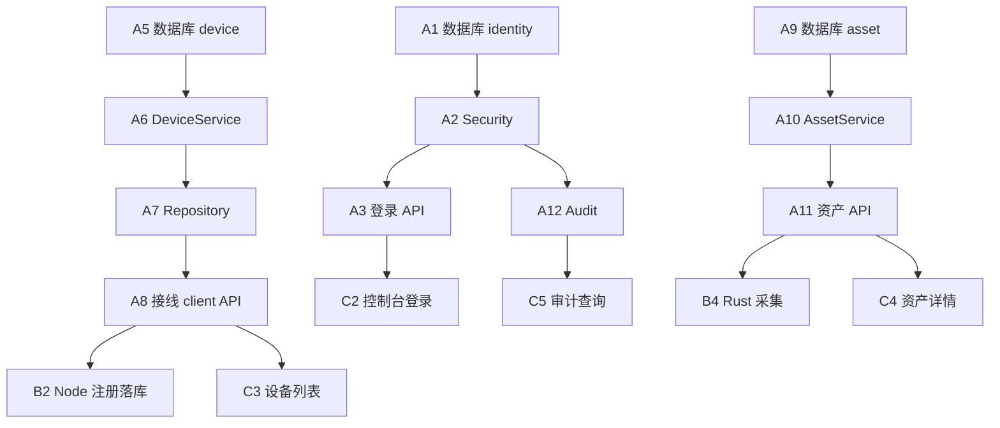

# SentinelHub 开发计划

> 技术栈已确定，本文档为可执行的开发路线图。按 **阶段目标 → 依赖顺序 → 并行轨道** 组织，不以日历排期约束实施。

## 1. 技术栈（已定稿）

| 层级 | 技术 | 目录 |
|------|------|------|
| 后端 API | Java 21, Spring Boot 3.3, Maven | `backend/` |
| 数据库 | MySQL 8.4, Flyway | `backend/server/.../db/migration/` |
| 缓存 / 消息 / 审计库 | Redis, NATS, ClickHouse | `deploy/docker-compose/` |
| 管理控制台 | React 18, TypeScript, Vite, Ant Design | `console/` |
| 统一客户端 UI | Flutter 3.24+, Dart, Riverpod, dio | `client/lib/` |
| PC 编排层 | Node.js 20+ ESM | `client/service/` |
| PC Native | Rust sidecar | `client/native/` |

**架构原则**：单体 API 服务 + `module.*` 业务分包；三通道 API（admin / app / client）；PC 端 Flutter（UI）+ Node（编排）+ Rust（深度能力）。

---

## 2. 当前基线（已完成）

| 类别 | 状态 |
|------|------|
| 架构文档 | ✅ 01–10 文档、模块划分、API 设计 |
| 后端骨架 | ✅ 三通道 Controller 桩、`module.*` 空 Service、Flyway V1（tenants/devices） |
| 控制台骨架 | ✅ Layout + 仪表盘/设备/审计静态页 |
| Flutter 骨架 | ✅ 自适应 Shell、5 页面、`ApiClient` / `LocalServiceClient` |
| PC 后台 | ✅ Node 注册/心跳/采集/本地 IPC；Rust sidecar 骨架 |
| 基础设施 | ✅ docker-compose（MySQL/Redis/NATS/CH/MinIO） |

**主要缺口**：鉴权、持久化、API↔模块接线、端到端闭环、Flutter 平台工程、控制台 API 对接。

---

## 3. 产品定义（开发前需锁定）

### 3.1 三端角色

| 端 | 用户 | 形态 | API |
|----|------|------|-----|
| 管理控制台 | 安全管理员 | PC 浏览器 | `/api/admin/v1` |
| PC 客户端 | 员工 | Flutter UI + Node + Rust | `/api/client/v1` + `/service` |
| 手机 App | **建议：员工自助端** | Flutter（与 PC 共用页面） | `/api/app/v1`（本机接口子集） |

> **决策建议**：手机端做员工自助（查本机合规/通知），不做完整管理员功能。管理员移动审批放到 P3 可选迭代。

### 3.2 PC 客户端三层职责（不再变更）

```
Flutter  →  展示、设置、读本地状态（:39201）
Node     →  云端通信、调度、策略编排
Rust     →  系统 API、采集、管控执行（P1+）
```

---

## 4. 阶段总览

```
P0 基础平台 ──► P1 管控增强 ──► P2 安全纵深 ──► P3 高级能力 ──► P4 智能化
   MVP           策略/合规          DLP/NAC        零信任/MDM         AI
```

| 阶段 | 目标 | 核心验收 |
|------|------|----------|
| **P0** | 可纳管、可审计、控制台可用 | 设备注册心跳落库、资产可见、管理员登录操作有审计 |
| **P1** | 策略下发、软件管控、合规评分 | 策略 3 分钟内生效、违规软件告警、合规分展示 |
| **P2** | DLP + 网络准入 | USB/外发阻断、不合规设备隔离 |
| **P3** | 零信任、MDM、远程 | 信任分策略、移动端基础纳管 |
| **P4** | AI 辅助运营 | 异常检测、NL 审计查询 |

---

## 5. P0 — 基础平台（MVP）

### 5.1 目标

打通 **PC 客户端注册 → 资产上报 → 控制台可见 → 操作可审计** 端到端链路。

### 5.2 里程碑

| 里程碑 | 交付物 | 验收标准 |
|--------|--------|----------|
| **M0.1 工程底座** | 数据库迁移、公共组件、安全框架 | 服务可启动、迁移可跑、统一错误响应 |
| **M0.2 身份与鉴权** | 登录、JWT、RBAC、租户隔离 | 控制台/API 无 token 返回 401 |
| **M0.3 设备纳管** | 注册、心跳、在线状态 | Node 注册后控制台可见设备在线 |
| **M0.4 资产管理** | 软硬件清单入库与查询 | 首报 5 分钟内控制台可查资产 |
| **M0.5 审计** | 写审计 + 管理端查询 | 登录、设备操作有审计记录 |
| **M0.6 三端 UI 闭环** | Console / Flutter / Node 接真实 API | 各端展示真实数据非占位 |

### 5.3 任务分解

#### 轨道 A：后端（优先）

| 序号 | 任务 | 模块 | 产出 |
|------|------|------|------|
| A1 | Flyway V2：users, roles, permissions, org_units | identity | 迁移脚本 |
| A2 | Spring Security + JWT 过滤器；`TenantContext` 拦截器 | identity | 三通道鉴权配置 |
| A3 | 登录 API：`POST /api/admin/v1/auth/login` | api.admin + identity | Token 签发 |
| A4 | RBAC 注解 / 方法级权限 | identity | `@PreAuthorize` |
| A5 | Flyway V3：devices 补全字段、device_groups | device | 与数据模型对齐 |
| A6 | `DeviceService`：register、heartbeat、online 状态（Redis） | device | 业务逻辑 |
| A7 | `DeviceRepository`（MyBatis-Plus 或 JdbcTemplate） | device | 持久化 |
| A8 | 接线：`ClientServiceController` → `DeviceService` | api.client | 去掉硬编码 |
| A9 | Flyway V4：asset_hardware, asset_software | asset | 资产表 |
| A10 | `AssetService`：接收上报、变更检测、查询 | asset | 业务逻辑 |
| A11 | 接线：`report/assets` → `AssetService` | api.client + api.admin | 上报 + 查询 API |
| A12 | `AuditService` + ClickHouse 写入适配 | audit | 审计管道 |
| A13 | 全局 `@ControllerAdvice`、请求 ID、`@Valid` DTO | common | API 规范落地 |
| A14 | 单元测试：identity、device 核心路径 | test | CI 可跑 |

#### 轨道 B：PC 客户端

| 序号 | 任务 | 目录 | 产出 |
|------|------|------|------|
| B1 | `flutter create` 生成 android/ios/windows/macos/linux | client/ | 可编译平台工程 |
| B2 | Node：持久化 client_id（本地文件）；register 失败重试 | service/ | 稳定身份 |
| B3 | Node：mTLS 预留（证书路径配置，P0 可先 HTTPS） | service/ | 安全基线 |
| B4 | Rust：完善 collect（内存、OS 版本、软件列表） | native/ | 替代部分 Node fallback |
| B5 | Flutter：Riverpod + 接 `ApiClient`（status/compliance） | lib/ | 真实数据展示 |
| B6 | Flutter：设置页读写服务器地址（shared_preferences） | lib/ | 可配置 |
| B7 | Flutter 桌面：启动时检测/提示 Node 服务状态 | lib/ | 已有 LocalServiceClient 增强 |

#### 轨道 C：管理控制台

| 序号 | 任务 | 目录 | 产出 |
|------|------|------|------|
| C1 | Axios 封装 + Token 存储 + 401 跳转登录 | console/ | API 层 |
| C2 | 登录页 + 路由守卫 | console/ | 鉴权闭环 |
| C3 | 设备列表接 `GET /api/admin/v1/devices` | console/ | 真实列表 |
| C4 | 设备详情 + 资产 Tab | console/ | 资产可见 |
| C5 | 审计页接 `GET /api/admin/v1/audit/logs` | console/ | 审计可查 |
| C6 | 仪表盘统计接 API | console/ | 概览数据 |

#### 轨道 D：基础设施

| 序号 | 任务 | 产出 |
|------|------|------|
| D1 | docker-compose 一键启动文档与 healthcheck 验证 | README |
| D2 | GitHub Actions：backend `mvn test` + console `npm run build` | CI |
| D3 | 种子数据脚本（默认租户 + 管理员账号） | 开发环境可用 |

### 5.4 P0 依赖顺序



**建议迭代顺序**（串行主线）：

1. M0.1 → M0.2（A1–A4, C1–C2）
2. M0.3（A5–A8, B2）
3. M0.4（A9–A11, B4）
4. M0.5（A12, C5）
5. M0.6（B1, B5–B7, C3–C6）

### 5.5 P0 验收清单

- [ ] 管理员可登录控制台，未登录访问 API 返回 401
- [ ] PC 客户端（Node）注册后，控制台 30 秒内显示设备在线
- [ ] 资产首报后，控制台可查看软硬件清单
- [ ] 登录、设备注册、策略查看（如有）写入审计并可检索
- [ ] Flutter 桌面端展示真实合规/状态（非占位符）
- [ ] `make dev-up && backend-run && npm start` 可完成手动 E2E 验证
- [ ] 500 台客户端压测：心跳 P99 &lt; 2s（可后置到 P0 末）

---

## 6. P1 — 管控增强

### 6.1 目标

策略统一下发，软件黑白名单与合规基线生效。

### 6.2 里程碑

| 里程碑 | 后端 | 客户端 | 控制台 |
|--------|------|--------|--------|
| **M1.1 策略引擎** | policy CRUD、版本、发布 | — | 策略编辑器 |
| **M1.2 策略下发** | heartbeat 返回 policy_bundle | Node 拉取、缓存、分发 Rust | — |
| **M1.3 软件管控** | software 规则 | Rust enforcer + Node 调度 | 违规告警列表 |
| **M1.4 合规检查** | compliance 基线、评分 | Rust collector | 合规仪表盘 |
| **M1.5 客户端展示** | compliance API 真实数据 | Flutter 合规页接 API | — |

### 6.3 关键任务

**后端**：`module.policy`（策略包 JSON schema）、`module.software`、`module.compliance`；Flyway 迁移；heartbeat 响应携带 `policy_bundle` 和 `commands`。

**Node**：`enforcers/software.js` 调度 native；本地策略缓存（加密文件）；策略版本对比与热更新。

**Rust**：`enforce software`、`compliance scan` 子命令；进程监控（Win/macOS/Linux 分平台实现）。

**Flutter**：合规页、通知页接 API；手机端推送（FCM/APNs）可选。

**控制台**：策略 CRUD UI、合规分数图表（ECharts）、软件违规事件列表。

### 6.4 P1 验收

- [ ] 策略发布后 3 分钟内客户端生效
- [ ] 黑名单软件启动被拦截并产生审计/告警
- [ ] 合规分数在控制台与 PC 客户端一致

---

## 7. P2 — 安全纵深

### 7.1 目标

DLP 与网络准入（NAC）上线。

### 7.2 里程碑

| 里程碑 | 说明 |
|--------|------|
| **M2.1 DLP 规则** | 规则引擎、USB/文件外发检测 |
| **M2.2 DLP 执行** | Rust 文件系统监控 + 可选驱动通信 |
| **M2.3 NAC** | 合规分数联动准入；测试环境 RADIUS 模板 |
| **M2.4 取证** | MinIO 存储 DLP 取证文件 |
| **M2.5 处置** | 控制台 DLP 事件工单流 |

### 7.3 架构注意

- DLP/NAC **必须走 Rust native**，Node 仅编排，不尝试纯 JS 实现
- 驱动级能力独立 `native/driver/` 或子仓库，与主进程隔离
- 不合规设备隔离在测试 VLAN 验证

---

## 8. P3 — 高级能力

| 模块 | 后端 | 客户端 | 说明 |
|------|------|--------|------|
| zerotrust | 信任分计算、应用访问策略 | PC agent 执行 | 依赖 compliance + nac |
| mdm | 基础策略 API | Flutter Platform Channel → iOS/Android 原生 | 与 PC native 分开 |
| remote | 会话管理、录像元数据 | PC 端远程协助客户端 | 会话全程审计 |

---

## 9. P4 — 智能化

- `module.ai`：异常行为检测（登录异常、批量下载）
- 控制台 NL 审计查询 PoC
- 不阻塞主链路，可独立迭代

---

## 10. 并行开发建议

按团队规模分配轨道，减少阻塞：

| 角色 | P0 主要负责 | 可并行 |
|------|-------------|--------|
| 后端 1 | 轨道 A（identity → device → asset） | 与 C 前期并行 |
| 后端 2 | audit + 公共组件 + 测试 | A 完成后 |
| 前端 | 轨道 C（console） | A3 完成后接 API |
| 客户端 | 轨道 B（Flutter + Node + Rust） | A8/A11 完成后接 API |
| DevOps | 轨道 D | 全程 |

**单人开发建议顺序**：A1→A2→A3 → A5→A6→A7→A8 → B2 → C2→C3 → A9→A10→A11 → B4→B5 → A12→C5 → C4→C6。

---

## 11. 分支与协作规范

| 类型 | 命名 | 说明 |
|------|------|------|
| 功能分支 | `feature/p0-identity-login` | 按里程碑拆分，小而频 |
| 模块分支 | `feature/M03-device-heartbeat` | 与 module ID 对齐 |
| 自动化 | `cursor/*` | Cloud Agent 开发 |

**合并前检查**：

1. Flyway 迁移可重复执行
2. 新增 API 更新 `docs/architecture/06-api-design.md`
3. 写操作有审计
4. 至少核心路径单元测试
5. 三端 API 不互相越权访问

---

## 12. 风险与缓解

| 风险 | 影响 | 缓解 |
|------|------|------|
| API 层与 module 长期脱节 | 重构成本 | P0 起强制 Controller 只调 Service |
| 手机端定位摇摆 | Flutter 页面返工 | 按 3.1 锁定员工自助端 |
| Rust 跨平台构建复杂 | CI 打包慢 | P0 用 Node fallback；P1 起 prebuild 矩阵 |
| 无鉴权上线 | 安全事故 | P0 M0.2 完成前禁止公网部署 |
| ClickHouse 运维 | 审计查询延迟 | P0 可先 MySQL 审计，P0 末迁 CH |
| Flutter 平台工程缺失 | 无法发版 | B1 为 P0 第一周任务 |

---

## 13. 近期行动项（下一步）

按优先级排列，建议从 **M0.1 + M0.2** 开始：

1. **Flyway V2**：users / roles / org_units 表
2. **Spring Security + JWT**：admin 通道登录
3. **DeviceService 实装**：register / heartbeat 落库 + Redis 在线状态
4. **ClientServiceController 接线**
5. **控制台登录页 + Axios 封装**
6. **`flutter create`** 生成平台工程
7. **种子数据**：默认管理员 `admin@demo.local` / 租户

完成以上 7 项后，即可进入设备纳管端到端联调（M0.3）。

---

## 14. 文档索引

| 文档 | 用途 |
|------|------|
| [04-module-design.md](./architecture/04-module-design.md) | 模块职责与依赖 |
| [05-data-model.md](./architecture/05-data-model.md) | 表结构参考 |
| [06-api-design.md](./architecture/06-api-design.md) | API 契约 |
| [09-roadmap.md](./architecture/09-roadmap.md) | 阶段目标与验收 |
| [10-client-technology-stack.md](./architecture/10-client-technology-stack.md) | 客户端技术细节 |
| [MODULES.md](./MODULES.md) | 模块索引 |
