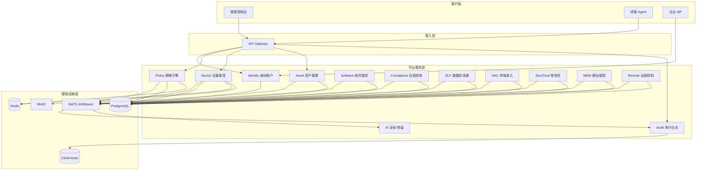

# 系统架构

## 1. 逻辑架构



## 2. 请求链路

### 2.1 管理员配置策略

```
Console → Gateway (JWT 校验) → Policy Service
  → 写入 PostgreSQL (策略版本)
  → 发布 NATS: policy.updated.{tenant_id}
  → Device Service 订阅 → 计算受影响设备集合
  → 写入 Redis 待下发队列
  → Agent 心跳/长轮询拉取 → 本地 Policy Engine 生效
  → Agent 上报执行结果 → Audit Service → ClickHouse
```

### 2.2 终端注册与心跳

```
Agent 首次启动 → 携带设备指纹 + 租户凭证 → Gateway → Device Service
  → 创建设备记录 (PostgreSQL)
  → 发布 device.registered
  → Asset Service 触发全量资产采集任务
  → 返回 Agent ID + mTLS 证书 + 初始配置

周期心跳 (默认 60s) → Device Service 更新 last_seen (Redis + PG)
  → 返回待执行指令 (策略增量、远程任务、合规扫描)
```

### 2.3 合规检查与 NAC 联动

```
Compliance Service 下发检查项 → Agent 执行 → 上报结果
  → Compliance 计算合规分数 → 写入 device.compliance_score
  → 发布 compliance.score_changed
  → NAC Service 订阅 → 更新准入决策缓存
  → 网络侧 (802.1X/RADIUS) 或 Agent 本地网络钩子执行放行/隔离
```

## 3. 物理部署架构

### 3.1 标准集群（推荐生产）

```
                    ┌─────────────┐
                    │   LB/Ingress │
                    └──────┬──────┘
           ┌───────────────┼───────────────┐
           │               │               │
    ┌──────▼──────┐ ┌──────▼──────┐ ┌──────▼──────┐
    │  Gateway x2 │ │ Console x2  │ │  gRPC Svc   │
    │  (无状态)    │ │  (静态资源)  │ │  (按域扩展)  │
    └──────┬──────┘ └─────────────┘ └──────┬──────┘
           │                               │
    ┌──────▼───────────────────────────────▼──────┐
    │              Kubernetes Cluster              │
    │  ┌─────────┐ ┌─────────┐ ┌───────────────┐  │
    │  │PostgreSQL│ │  Redis  │ │ NATS Cluster │  │
    │  │ (主从)   │ │ (哨兵)  │ │              │  │
    │  └─────────┘ └─────────┘ └───────────────┘  │
    │  ┌─────────────┐ ┌─────────┐                │
    │  │ ClickHouse  │ │  MinIO  │                │
    │  │  (分片副本)  │ │         │                │
    │  └─────────────┘ └─────────┘                │
    └─────────────────────────────────────────────┘
```

### 3.2 小型私有化（单机 Docker Compose）

适用于 &lt; 2000 终端：所有服务单副本，PostgreSQL/Redis/NATS/ClickHouse 各一实例。

## 4. 多租户模型

```
Tenant (租户)
  ├── OrgUnit (组织单元，树形)
  ├── User (用户，RBAC)
  ├── Device (设备，归属 OrgUnit)
  ├── Policy (策略，可绑定 OrgUnit/DeviceGroup)
  └── License (授权模块与终端数上限)
```

- **数据隔离**：所有业务表带 `tenant_id`，网关层注入租户上下文
- **网络隔离**：可选独立子域名或独立集群（大客户）
- **模块授权**：License 控制 DLP/NAC/零信任等模块开关

## 5. Agent 与云端连接模式

| 模式 | 适用场景 | 实现 |
|------|----------|------|
| 长轮询 | 默认，防火墙友好 | Agent 每 30-60s 请求 `/agent/v1/sync` |
| WebSocket | 需要实时指令 | 远程控制、紧急策略 |
| MQTT (可选) | 超大规模 | 独立 MQTT Broker，Agent 订阅租户主题 |

证书：每个 Agent 持有唯一客户端证书，由 Device Service 在注册时签发（内部 CA）。

## 6. 事件驱动约定

主题命名：`sentinel.{domain}.{action}.{tenant_id}`

示例：
- `sentinel.policy.updated.t001`
- `sentinel.device.registered.t001`
- `sentinel.compliance.failed.t001`
- `sentinel.dlp.blocked.t001`

所有安全相关事件 **必须** 被 Audit Service 消费并落库，业务服务禁止仅写本地日志。

## 7. 高可用与容量参考

| 指标 | 1万终端 | 5万终端 |
|------|---------|---------|
| Gateway | 2 实例 4C8G | 4 实例 8C16G |
| Device/Policy | 各 2 实例 | 各 4 实例 |
| PostgreSQL | 8C32G 主从 | 16C64G + 读副本 |
| ClickHouse | 3 节点 | 5 节点 |
| NATS | 3 节点集群 | 3-5 节点 |

心跳聚合：Device Service 使用 Redis 批量刷盘，降低 PG 写压力。
