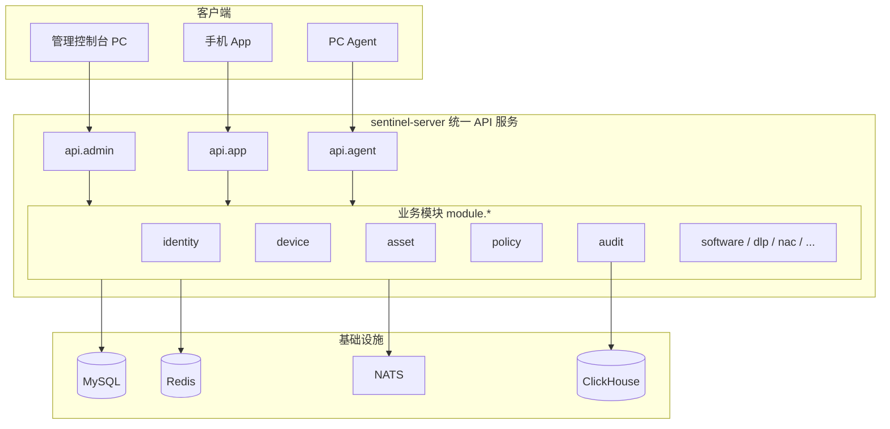

# 系统架构

## 1. 架构模式：单体 API + 业务模块分包

SentinelHub 采用 **单一 API 服务、内部分业务模块** 的架构，避免微服务带来的运维复杂度，同时保持代码按域清晰拆分。

```
┌─────────────────────────────────────────────────────────────┐
│                    sentinel-server (:8080)                   │
│  ┌───────────────────────────────────────────────────────┐  │
│  │                    API 接入层                          │  │
│  │  api.admin   api.app   api.agent                       │  │
│  │  管理端 PC    手机 App   PC 终端 Agent                   │  │
│  └─────────────────────────┬─────────────────────────────┘  │
│  ┌─────────────────────────▼─────────────────────────────┐  │
│  │                   业务模块层 (module.*)                  │  │
│  │  identity │ device │ asset │ audit │ policy │ dlp │ ... │  │
│  └─────────────────────────┬─────────────────────────────┘  │
│  ┌─────────────────────────▼─────────────────────────────┐  │
│  │              基础设施 (DB / Redis / NATS / CH)          │  │
│  └───────────────────────────────────────────────────────┘  │
└─────────────────────────────────────────────────────────────┘
```

## 2. 三端 API 设计

| 端 | 路径前缀 | 客户端 | 认证方式 |
|----|----------|--------|----------|
| **管理端** | `/api/admin/v1` | Web 控制台（PC 浏览器） | JWT / OIDC |
| **移动端** | `/api/app/v1` | 手机管理 App（iOS/Android） | JWT + 设备绑定 |
| **终端** | `/agent/v1` | PC Agent（Win/macOS/Linux） | mTLS + Agent 证书 |

三个 API 层共享同一套 `module.*` 业务逻辑，仅在入参校验、响应裁剪、权限控制上有差异。

## 3. 请求链路

### 3.1 管理员配置策略

```
Console (PC) → POST /api/admin/v1/policies
  → api.admin.PolicyController
  → module.policy.PolicyService
  → MySQL
  → 发布内部事件 → module.audit 记录
  → Agent 心跳拉取 → POST /agent/v1/heartbeat 返回策略包
```

### 3.2 手机 App 查看设备

```
Mobile App → GET /api/app/v1/devices/summary
  → api.app.AppDeviceController
  → module.device.DeviceService
  → 返回当前用户可见设备摘要（移动端优化字段）
```

### 3.3 终端注册与心跳

```
PC Agent → POST /agent/v1/register
  → api.agent.AgentApiController
  → module.device.DeviceService.register()
  → 签发 mTLS 证书，触发 module.asset 采集

周期心跳 → POST /agent/v1/heartbeat
  → 返回策略增量、合规任务、远程指令
```

## 4. 逻辑架构



## 5. 物理部署

### 5.1 标准部署（推荐）

```
                    ┌─────────────┐
                    │   LB/Ingress │
                    └──────┬──────┘
                           │
              ┌────────────┼────────────┐
              │            │            │
       ┌──────▼──────┐ ┌───▼───┐ ┌──────▼──────┐
       │ sentinel-   │ │console│ │  mobile CDN │
       │ server x2   │ │ (静态) │ │  (App 分发)  │
       └──────┬──────┘ └───────┘ └─────────────┘
              │
    ┌─────────▼──────────────────────────┐
    │  MySQL │ Redis │ NATS │ CH    │
    └────────────────────────────────────┘
```

### 5.2 小型私有化

单实例 `sentinel-server` + docker-compose 基础设施，适用于 &lt; 5000 终端。

## 6. 多租户模型

不变：所有业务表带 `tenant_id`，`module.identity` 负责租户上下文，`api.*` 层从 Token 注入。

## 7. 何时拆分微服务

当前阶段 **不拆分**。仅在以下情况考虑独立服务：
- 单模块 CPU/内存占用超过整机 60%
- 需要独立扩缩容（如审计写入 ClickHouse）
- 团队规模 &gt; 20 人且模块完全独立发布

届时可将 `module.audit` 等抽为独立进程，API 层通过接口调用，无需重写业务逻辑。
