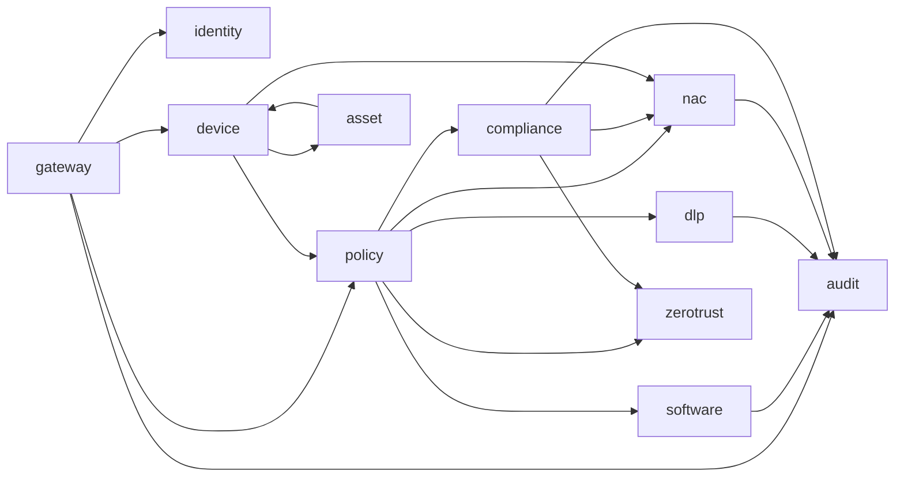

# 功能模块设计

本文档定义各业务模块的职责边界、对外接口、数据依赖与开发顺序。

## 1. 模块总览

| 模块 ID | 服务名 | 目录 | 阶段 | 状态 |
|---------|--------|------|------|------|
| M01 | gateway | `backend/gateway` | P0 | 骨架 |
| M02 | identity | `backend/identity` | P0 | 骨架 |
| M03 | device | `backend/device` | P0 | 骨架 |
| M04 | asset | `backend/asset` | P0 | 骨架 |
| M05 | audit | `backend/audit` | P0 | 骨架 |
| M06 | policy | `backend/policy` | P1 | 骨架 |
| M07 | software | `backend/software` | P1 | 骨架 |
| M08 | compliance | `backend/compliance` | P1 | 骨架 |
| M09 | dlp | `backend/dlp` | P2 | 骨架 |
| M10 | nac | `backend/nac` | P2 | 骨架 |
| M11 | zerotrust | `backend/zerotrust` | P3 | 骨架 |
| M12 | mdm | `backend/mdm` | P3 | 骨架 |
| M13 | remote | `backend/remote` | P3 | 骨架 |
| M14 | ai | `backend/ai` | P4 | 预留 |
| — | agent | `agent` | P0 | 骨架 |
| — | console | `console` | P0 | 骨架 |

## 2. 平台基础模块

### M01 Gateway（API 网关）

**职责**
- HTTP/HTTPS 统一入口，路由到各微服务
- JWT/OIDC 令牌校验，租户上下文注入
- 限流、CORS、请求日志、API 版本路由 (`/api/v1`)

**对外接口**
- `GET /health`
- 代理 `/api/v1/*` → 各服务 REST
- `WS /api/v1/ws` → 实时通知

**依赖**：identity（公钥/JWKS）、Redis（限流）

---

### M02 Identity（身份与租户）

**职责**
- 租户、组织单元、用户、角色 (RBAC)
- OIDC 集成、API Key（Agent 注册）
- License 模块授权校验

**核心 API**
- `POST /api/v1/auth/login`
- `GET /api/v1/users`, `GET /api/v1/roles`
- `GET /api/v1/tenants/{id}/license`

**事件发布**
- `sentinel.identity.user.created`
- `sentinel.identity.license.updated`

**依赖**：PostgreSQL

---

### M03 Device（设备管控）

**职责**
- 设备注册、分组、在线状态、心跳
- Agent 证书签发与吊销
- 指令队列（策略同步、远程任务触发）

**核心 API**
- `POST /api/v1/agent/register`
- `POST /api/v1/agent/heartbeat`
- `GET /api/v1/devices`, `PATCH /api/v1/devices/{id}`
- `POST /api/v1/device-groups`

**Agent 协议**
- 见 `proto/agent/v1/device.proto`

**事件**
- `sentinel.device.registered`
- `sentinel.device.offline`（超时检测）

**依赖**：PostgreSQL, Redis, MinIO（证书）, policy（策略版本）

---

### M04 Asset（资产管理）

**职责**
- 硬件清单（CPU/内存/磁盘/网卡）
- 软件清单（安装包、版本、厂商）
- 资产变更检测与 CMDB 导出

**核心 API**
- `GET /api/v1/assets/devices/{device_id}`
- `GET /api/v1/assets/software`
- `POST /api/v1/assets/export`

**数据流**
- 订阅 `device.registered` → 触发全量采集
- 消费 Agent 上报 `asset.inventory`

**依赖**：PostgreSQL, device

---

### M05 Audit（审计日志）

**职责**
- 统一接收各模块审计事件
- 查询、导出、留存策略
- 对接 SIEM（Syslog/Webhook）

**核心 API**
- `GET /api/v1/audit/logs`（多维度筛选）
- `POST /api/v1/audit/export`

**写入**
- 订阅 NATS `sentinel.>` 全量安全事件
- Agent 直传操作类日志

**依赖**：ClickHouse, MinIO（导出文件）

## 3. 策略与管控模块

### M06 Policy（策略引擎）

**职责**
- 策略模板、策略集、版本管理
- 策略冲突检测与生效范围计算
- 策略包编译（供 Agent 本地执行）

**策略类型枚举**
```go
type PolicyType string
const (
    PolicySoftware   PolicyType = "software"
    PolicyCompliance PolicyType = "compliance"
    PolicyDLP        PolicyType = "dlp"
    PolicyNAC        PolicyType = "nac"
    PolicyZeroTrust  PolicyType = "zerotrust"
    PolicyMDM        PolicyType = "mdm"
    PolicyRemote     PolicyType = "remote"
)
```

**核心 API**
- `CRUD /api/v1/policies`
- `POST /api/v1/policies/{id}/publish`
- `GET /api/v1/policies/effective?device_id=`

**依赖**：PostgreSQL, Redis, NATS

---

### M07 Software（软件管控）

**职责**
- 软件白名单/黑名单策略
- 安装拦截、运行拦截、违规软件告警
- 与 asset 软件清单联动

**Agent Enforcer**：`agent/enforcers/software`

**事件**：`sentinel.software.violation`

---

### M08 Compliance（合规检查）

**职责**
- 合规基线库（等保/CIS/自定义）
- 检查任务调度与结果评分
- 不合规项修复建议 / 自动修复脚本

**核心 API**
- `GET /api/v1/compliance/baselines`
- `POST /api/v1/compliance/scans`
- `GET /api/v1/compliance/devices/{id}/score`

**输出**：`compliance_score` 供 NAC/零信任消费

---

### M09 DLP（数据防泄漏）

**职责**
- 敏感数据识别规则（正则、关键词、文档指纹）
- 通道管控：USB、打印、剪贴板、邮件、IM、外发文件
- 水印、加密、阻断、审批放行

**Agent Enforcer**：`agent/enforcers/dlp`

**存储**：DLP 事件 → ClickHouse；取证文件 → MinIO

---

### M10 NAC（终端准入）

**职责**
- 准入策略（合规分数、AV 状态、域加入等）
- 与网络设备对接：RADIUS、802.1X、交换机 CoA
- VLAN 动态分配、隔离区

**部署组件**
- `backend/nac`：策略与决策
- `deploy/nac/radius`：FreeRADIUS 配置模板（可选）

---

### M11 ZeroTrust（零信任）

**职责**
- 设备信任分、用户信任分、持续评估
- 应用级访问代理（SDP 轻量实现或对接现有 ZTNA）
- 微隔离策略

**与 NAC 关系**：NAC 管网络层准入；零信任管应用层访问，共享设备信任分。

---

### M12 MDM（移动设备管理）

**职责**
- iOS/Android 设备注册（ABM/EMM 对接）
- 配置描述文件、应用分发、远程擦除
- 与工作手机容器化方案集成

**说明**：移动端 Agent 或 MDM 协议与桌面 Agent 分轨，共享 device/asset 模型。

---

### M13 Remote（远程控制）

**职责**
- 远程桌面会话建立（需用户确认或可配置静默）
- 会话录制、双人授权、操作审计
- 文件传输（受 DLP 策略约束）

**协议**：WebRTC 信令经 Gateway，媒体可 P2P 或 TURN 中继

---

### M14 AI（安全能力，预留）

**职责**
- 用户/设备异常行为检测（UEBA 轻量）
- 策略推荐与自然语言查询
- 威胁情报关联

**接入点**
- 消费 ClickHouse 审计流
- 提供 `POST /api/v1/ai/query` 供控制台调用
- 插件接口：`backend/ai` 模块 SPI 扩展点

## 4. 终端 Agent 模块

```
agent/
├── cmd/agent/              # 主程序入口
├── core/                   # 配置、升级、自检
├── transport/              # mTLS、同步协议
├── policy/                 # 本地策略引擎
├── collectors/             # 资产/软件/合规采集
├── enforcers/              # 各管控插件
│   ├── software/
│   ├── dlp/
│   ├── nac/
│   └── ...
└── platform/               # OS 特定实现
    ├── windows/
    ├── darwin/
    └── linux/
```

**与云端契约**：`proto/agent/v1/*.proto`

## 5. 管理控制台

```
console/
├── src/
│   ├── pages/              # 按模块分页面
│   │   ├── dashboard/
│   │   ├── devices/
│   │   ├── assets/
│   │   ├── policies/
│   │   ├── compliance/
│   │   ├── dlp/
│   │   ├── audit/
│   │   └── ...
│   ├── services/           # API 客户端
│   └── components/
```

## 6. 模块依赖图



## 7. 模块开发规范

1. 每个服务为 `backend/` 下独立 Gradle 子模块，共享 `common` 公共库
2. 服务间 **禁止** 直接读对方数据库，仅通过 gRPC / OpenFeign / NATS
3. 新增模块必须：proto 定义、OpenAPI 片段、Flyway 迁移、README
4. 所有写操作产生审计事件，格式见 `com.sentinelhub.common.audit.AuditEvent`
