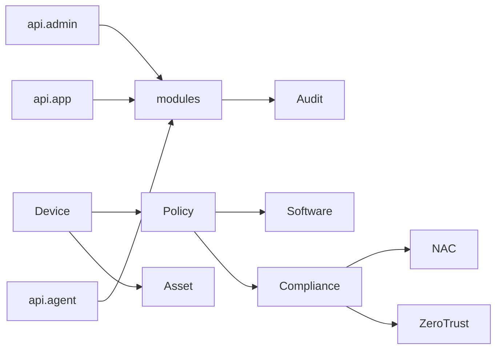

# 功能模块设计

本文档定义业务模块的职责边界、API 分层与开发顺序。

> **架构原则**：不按微服务拆进程，按 **业务包（module.*）** 组织代码，由 **单一 sentinel-server** 对外提供 API。

## 1. 模块总览

### 1.1 API 接入层

| 包路径 | 路径前缀 | 客户端 | 阶段 |
|--------|----------|--------|------|
| `api.admin` | `/api/admin/v1` | Web 管理控制台（PC） | P0 |
| `api.app` | `/api/app/v1` | 手机管理 App | P0 |
| `api.agent` | `/agent/v1` | PC 终端 Agent | P0 |

### 1.2 业务模块层

| 模块 ID | 包路径 | 阶段 | 状态 |
|---------|--------|------|------|
| M02 | `module.identity` | P0 | 骨架 |
| M03 | `module.device` | P0 | 骨架 |
| M04 | `module.asset` | P0 | 骨架 |
| M05 | `module.audit` | P0 | 骨架 |
| M06 | `module.policy` | P1 | 骨架 |
| M07 | `module.software` | P1 | 骨架 |
| M08 | `module.compliance` | P1 | 骨架 |
| M09 | `module.dlp` | P2 | 骨架 |
| M10 | `module.nac` | P2 | 骨架 |
| M11 | `module.zerotrust` | P3 | 骨架 |
| M12 | `module.mdm` | P3 | 骨架 |
| M13 | `module.remote` | P3 | 骨架 |
| M14 | `module.ai` | P4 | 预留 |

## 2. 代码结构

```
backend/server/src/main/java/com/sentinelhub/
├── SentinelHubApplication.java
├── config/                     # 全局配置、安全、WebMvc
├── api/
│   ├── admin/                  # 管理端 Controller
│   │   ├── AdminDeviceController.java
│   │   ├── AdminPolicyController.java
│   │   └── ...
│   ├── app/                    # 移动端 Controller
│   │   ├── AppDeviceController.java
│   │   └── ...
│   └── agent/                  # 终端 Controller
│       ├── AgentApiController.java
│       └── ...
└── module/
    ├── device/
    │   ├── DeviceService.java
    │   ├── DeviceRepository.java
    │   └── domain/
    ├── asset/
    └── ...
```

**调用关系**：`api.*` → `module.*`，禁止 `api.admin` 直接访问 `api.agent` 的包。

## 3. 业务模块详情

### M02 Identity（身份与租户）

**职责**：租户、组织、用户、RBAC、License

**被调用方**：
- `api.admin` — 用户管理、登录
- `api.app` — 移动端登录、个人中心

---

### M03 Device（设备管控）

**职责**：设备注册、分组、在线状态、心跳、指令队列

**API 暴露**：
- Admin: `GET/POST /api/admin/v1/devices`
- App: `GET /api/app/v1/devices`
- Agent: `POST /agent/v1/register`, `POST /agent/v1/heartbeat`

---

### M04 Asset（资产管理）

**职责**：硬件/软件清单、变更检测

**API 暴露**：
- Admin: `GET /api/admin/v1/assets/**`
- Agent: `POST /agent/v1/report/assets`

---

### M05 Audit（审计日志）

**职责**：统一审计写入与查询

**API 暴露**：
- Admin: `GET /api/admin/v1/audit/logs`
- 内部：各 module 通过 `AuditService` 写入

---

### M06~M14 其他模块

策略、软件管控、合规、DLP、NAC、零信任、MDM、远程、AI — 业务逻辑均在 `module.*` 实现，管理类 API 走 `api.admin`，终端执行走 `api.agent`，移动端查看走 `api.app`。

## 4. 三端 API 差异示例（设备列表）

| 端 | 接口 | 差异 |
|----|------|------|
| Admin | `GET /api/admin/v1/devices` | 全量字段、分页、导出、管理操作 |
| App | `GET /api/app/v1/devices` | 精简字段、仅当前用户相关设备 |
| Agent | `POST /agent/v1/heartbeat` | 上报状态、拉取指令，非查询列表 |

## 5. 模块依赖



## 6. 开发规范

1. 新业务先在 `module.{name}` 实现 Service/Repository
2. 按客户端在 `api.admin` / `api.app` / `api.agent` 添加 Controller
3. 禁止跨 module 直接访问 Repository，通过 Service 接口调用
4. 所有写操作调用 `module.audit.AuditService` 记录
5. 数据库迁移：`server/src/main/resources/db/migration/`
