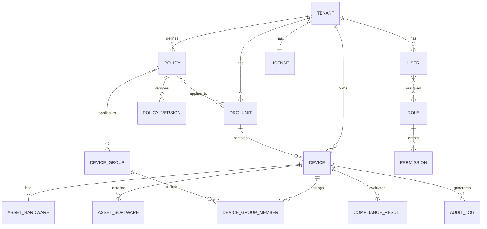

# 核心数据模型

## 1. ER 关系概览



## 2. 公共字段约定

所有租户级表包含：

```sql
tenant_id    UUID NOT NULL,
created_at   TIMESTAMPTZ NOT NULL DEFAULT now(),
updated_at   TIMESTAMPTZ NOT NULL DEFAULT now(),
deleted_at   TIMESTAMPTZ NULL  -- 软删除
```

## 3. 核心表定义

### 3.1 租户与身份

```sql
-- 租户
CREATE TABLE tenants (
    id          UUID PRIMARY KEY DEFAULT gen_random_uuid(),
    name        VARCHAR(128) NOT NULL,
    slug        VARCHAR(64) UNIQUE NOT NULL,
    status      VARCHAR(16) NOT NULL DEFAULT 'active',
    settings    JSONB NOT NULL DEFAULT '{}',
    created_at  TIMESTAMPTZ NOT NULL DEFAULT now(),
    updated_at  TIMESTAMPTZ NOT NULL DEFAULT now()
);

-- 组织单元（树形）
CREATE TABLE org_units (
    id          UUID PRIMARY KEY DEFAULT gen_random_uuid(),
    tenant_id   UUID NOT NULL REFERENCES tenants(id),
    parent_id   UUID REFERENCES org_units(id),
    name        VARCHAR(128) NOT NULL,
    path        LTREE NOT NULL,  -- 物化路径，便于子树查询
    created_at  TIMESTAMPTZ NOT NULL DEFAULT now(),
    updated_at  TIMESTAMPTZ NOT NULL DEFAULT now()
);

-- 用户
CREATE TABLE users (
    id          UUID PRIMARY KEY DEFAULT gen_random_uuid(),
    tenant_id   UUID NOT NULL REFERENCES tenants(id),
    org_unit_id UUID REFERENCES org_units(id),
    email       VARCHAR(256) NOT NULL,
    name        VARCHAR(128) NOT NULL,
    status      VARCHAR(16) NOT NULL DEFAULT 'active',
    created_at  TIMESTAMPTZ NOT NULL DEFAULT now(),
    updated_at  TIMESTAMPTZ NOT NULL DEFAULT now(),
    UNIQUE (tenant_id, email)
);

-- 角色与权限（RBAC）
CREATE TABLE roles (
    id          UUID PRIMARY KEY DEFAULT gen_random_uuid(),
    tenant_id   UUID NOT NULL REFERENCES tenants(id),
    name        VARCHAR(64) NOT NULL,
    permissions JSONB NOT NULL DEFAULT '[]',
    created_at  TIMESTAMPTZ NOT NULL DEFAULT now(),
    UNIQUE (tenant_id, name)
);

-- 授权许可
CREATE TABLE licenses (
    id              UUID PRIMARY KEY DEFAULT gen_random_uuid(),
    tenant_id       UUID NOT NULL UNIQUE REFERENCES tenants(id),
    max_devices     INT NOT NULL DEFAULT 100,
    enabled_modules JSONB NOT NULL DEFAULT '["device","asset","audit"]',
    expires_at      TIMESTAMPTZ,
    created_at      TIMESTAMPTZ NOT NULL DEFAULT now()
);
```

### 3.2 设备与分组

```sql
CREATE TABLE devices (
    id              UUID PRIMARY KEY DEFAULT gen_random_uuid(),
    tenant_id       UUID NOT NULL REFERENCES tenants(id),
    org_unit_id     UUID REFERENCES org_units(id),
    agent_id        VARCHAR(64) NOT NULL,          -- Agent 实例 ID
    hostname        VARCHAR(256),
    os_type         VARCHAR(16) NOT NULL,          -- windows|darwin|linux|ios|android
    os_version      VARCHAR(64),
    hardware_id     VARCHAR(128) NOT NULL,         -- 设备指纹
    status          VARCHAR(16) NOT NULL DEFAULT 'pending',  -- pending|active|offline|revoked
    last_seen_at    TIMESTAMPTZ,
    compliance_score SMALLINT,                     -- 0-100
    trust_score     SMALLINT,                      -- 零信任信任分
    metadata        JSONB NOT NULL DEFAULT '{}',
    created_at      TIMESTAMPTZ NOT NULL DEFAULT now(),
    updated_at      TIMESTAMPTZ NOT NULL DEFAULT now(),
    UNIQUE (tenant_id, agent_id)
);

CREATE INDEX idx_devices_tenant_status ON devices(tenant_id, status);
CREATE INDEX idx_devices_last_seen ON devices(tenant_id, last_seen_at);

CREATE TABLE device_groups (
    id          UUID PRIMARY KEY DEFAULT gen_random_uuid(),
    tenant_id   UUID NOT NULL REFERENCES tenants(id),
    name        VARCHAR(128) NOT NULL,
    description TEXT,
    created_at  TIMESTAMPTZ NOT NULL DEFAULT now(),
    UNIQUE (tenant_id, name)
);

CREATE TABLE device_group_members (
    device_id       UUID NOT NULL REFERENCES devices(id),
    device_group_id UUID NOT NULL REFERENCES device_groups(id),
    PRIMARY KEY (device_id, device_group_id)
);
```

### 3.3 资产

```sql
CREATE TABLE asset_hardware (
    device_id   UUID PRIMARY KEY REFERENCES devices(id),
    tenant_id   UUID NOT NULL,
    cpu         JSONB,
    memory_mb   INT,
    disks       JSONB,
    nics        JSONB,
    collected_at TIMESTAMPTZ NOT NULL,
    updated_at  TIMESTAMPTZ NOT NULL DEFAULT now()
);

CREATE TABLE asset_software (
    id          UUID PRIMARY KEY DEFAULT gen_random_uuid(),
    device_id   UUID NOT NULL REFERENCES devices(id),
    tenant_id   UUID NOT NULL,
    name        VARCHAR(256) NOT NULL,
    version     VARCHAR(128),
    publisher   VARCHAR(256),
    install_path TEXT,
    collected_at TIMESTAMPTZ NOT NULL,
    UNIQUE (device_id, name, version)
);

CREATE INDEX idx_asset_software_tenant ON asset_software(tenant_id, name);
```

### 3.4 策略

```sql
CREATE TABLE policies (
    id          UUID PRIMARY KEY DEFAULT gen_random_uuid(),
    tenant_id   UUID NOT NULL REFERENCES tenants(id),
    name        VARCHAR(128) NOT NULL,
    type        VARCHAR(32) NOT NULL,              -- software|dlp|nac|...
    status      VARCHAR(16) NOT NULL DEFAULT 'draft',  -- draft|published|archived
    priority    INT NOT NULL DEFAULT 100,
    scope       JSONB NOT NULL DEFAULT '{}',       -- org_unit_ids, device_group_ids, device_ids
    created_by  UUID REFERENCES users(id),
    created_at  TIMESTAMPTZ NOT NULL DEFAULT now(),
    updated_at  TIMESTAMPTZ NOT NULL DEFAULT now()
);

CREATE TABLE policy_versions (
    id          UUID PRIMARY KEY DEFAULT gen_random_uuid(),
    policy_id   UUID NOT NULL REFERENCES policies(id),
    version     INT NOT NULL,
    content     JSONB NOT NULL,                    -- 策略 DSL JSON
    published_at TIMESTAMPTZ,
    published_by UUID REFERENCES users(id),
    UNIQUE (policy_id, version)
);
```

### 3.5 合规

```sql
CREATE TABLE compliance_baselines (
    id          UUID PRIMARY KEY DEFAULT gen_random_uuid(),
    tenant_id   UUID NOT NULL REFERENCES tenants(id),
    name        VARCHAR(128) NOT NULL,
    framework   VARCHAR(32),                       -- cis|djbh|custom
    rules       JSONB NOT NULL,
    created_at  TIMESTAMPTZ NOT NULL DEFAULT now()
);

CREATE TABLE compliance_results (
    id          UUID PRIMARY KEY DEFAULT gen_random_uuid(),
    tenant_id   UUID NOT NULL,
    device_id   UUID NOT NULL REFERENCES devices(id),
    baseline_id UUID NOT NULL REFERENCES compliance_baselines(id),
    score       SMALLINT NOT NULL,
    passed      INT NOT NULL,
    failed      INT NOT NULL,
    details     JSONB NOT NULL,
    scanned_at  TIMESTAMPTZ NOT NULL
);

CREATE INDEX idx_compliance_device ON compliance_results(device_id, scanned_at DESC);
```

### 3.6 审计（ClickHouse）

```sql
CREATE TABLE audit_logs (
    event_id        UUID,
    tenant_id       UUID,
    timestamp       DateTime64(3),
    event_type      LowCardinality(String),   -- policy.update|dlp.block|device.register|...
    actor_type      LowCardinality(String),   -- user|agent|system
    actor_id        String,
    resource_type   LowCardinality(String),
    resource_id     String,
    device_id       Nullable(UUID),
    action          LowCardinality(String),
    result          LowCardinality(String),   -- success|failure|blocked
    client_ip       Nullable(IPv4),
    metadata        String,                   -- JSON
    INDEX idx_tenant_time (tenant_id, timestamp) TYPE minmax GRANULARITY 1
) ENGINE = MergeTree()
PARTITION BY toYYYYMM(timestamp)
ORDER BY (tenant_id, timestamp, event_id)
TTL timestamp + INTERVAL 365 DAY;
```

## 4. Redis 数据结构

| Key 模式 | 类型 | 用途 |
|----------|------|------|
| `device:online:{tenant_id}` | SET | 在线设备 agent_id |
| `device:heartbeat:{device_id}` | STRING | 最后心跳时间戳 |
| `policy:effective:{device_id}` | STRING | 生效策略包 hash |
| `policy:pending:{device_id}` | LIST | 待下发指令队列 |
| `session:{token_hash}` | STRING | 用户会话 |
| `ratelimit:{ip}` | STRING | 网关限流计数 |

## 5. 策略 DSL 示例（软件管控）

```json
{
  "type": "software",
  "version": 1,
  "rules": [
    {
      "id": "rule-001",
      "action": "block",
      "match": {
        "mode": "blacklist",
        "items": [
          { "name": "BitTorrent*", "publisher": null },
          { "name": null, "publisher": "Unknown Publisher" }
        ]
      },
      "on_violation": {
        "alert": true,
        "audit": true,
        "notify_admin": false
      }
    }
  ]
}
```

## 6. 迁移管理

- 路径：`services/{name}/migrations/`
- 工具：golang-migrate
- 命名：`000001_init.up.sql` / `000001_init.down.sql`
- 共享基础表：`deploy/migrations/platform/`
