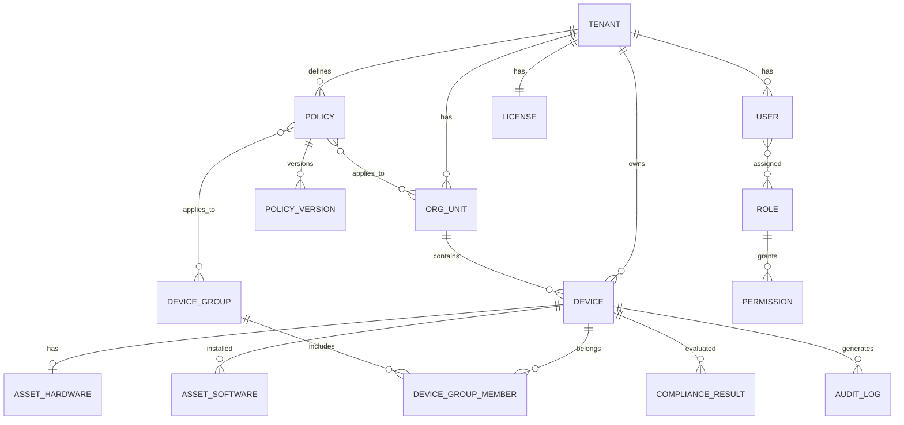

# 核心数据模型

> **数据库**：MySQL 8.4，字符集 `utf8mb4`，引擎 `InnoDB`。主键使用 `CHAR(36)` 存储 UUID。

## 1. ER 关系概览



## 2. 公共字段约定

所有租户级表包含：

```sql
tenant_id    CHAR(36)    NOT NULL,
created_at   DATETIME(3) NOT NULL DEFAULT CURRENT_TIMESTAMP(3),
updated_at   DATETIME(3) NOT NULL DEFAULT CURRENT_TIMESTAMP(3) ON UPDATE CURRENT_TIMESTAMP(3),
deleted_at   DATETIME(3) NULL  -- 软删除
```

## 3. 核心表定义

### 3.1 租户与身份

```sql
-- 租户
CREATE TABLE tenants (
    id          CHAR(36)     PRIMARY KEY DEFAULT (UUID()),
    name        VARCHAR(128) NOT NULL,
    slug        VARCHAR(64)  NOT NULL,
    status      VARCHAR(16)  NOT NULL DEFAULT 'active',
    settings    JSON         NOT NULL DEFAULT (JSON_OBJECT()),
    created_at  DATETIME(3)  NOT NULL DEFAULT CURRENT_TIMESTAMP(3),
    updated_at  DATETIME(3)  NOT NULL DEFAULT CURRENT_TIMESTAMP(3) ON UPDATE CURRENT_TIMESTAMP(3),
    UNIQUE KEY uk_tenants_slug (slug)
) ENGINE=InnoDB DEFAULT CHARSET=utf8mb4;

-- 组织单元（树形，物化路径）
CREATE TABLE org_units (
    id          CHAR(36)     PRIMARY KEY DEFAULT (UUID()),
    tenant_id   CHAR(36)     NOT NULL,
    parent_id   CHAR(36)     NULL,
    name        VARCHAR(128) NOT NULL,
    path        VARCHAR(512) NOT NULL,  -- 如 /root_id/dept_id/
    created_at  DATETIME(3)  NOT NULL DEFAULT CURRENT_TIMESTAMP(3),
    updated_at  DATETIME(3)  NOT NULL DEFAULT CURRENT_TIMESTAMP(3) ON UPDATE CURRENT_TIMESTAMP(3),
    KEY idx_org_units_tenant_path (tenant_id, path),
    CONSTRAINT fk_org_units_tenant FOREIGN KEY (tenant_id) REFERENCES tenants(id)
) ENGINE=InnoDB DEFAULT CHARSET=utf8mb4;

-- 用户
CREATE TABLE users (
    id          CHAR(36)     PRIMARY KEY DEFAULT (UUID()),
    tenant_id   CHAR(36)     NOT NULL,
    org_unit_id CHAR(36)     NULL,
    email       VARCHAR(256) NOT NULL,
    name        VARCHAR(128) NOT NULL,
    status      VARCHAR(16)  NOT NULL DEFAULT 'active',
    created_at  DATETIME(3)  NOT NULL DEFAULT CURRENT_TIMESTAMP(3),
    updated_at  DATETIME(3)  NOT NULL DEFAULT CURRENT_TIMESTAMP(3) ON UPDATE CURRENT_TIMESTAMP(3),
    UNIQUE KEY uk_users_tenant_email (tenant_id, email),
    CONSTRAINT fk_users_tenant FOREIGN KEY (tenant_id) REFERENCES tenants(id)
) ENGINE=InnoDB DEFAULT CHARSET=utf8mb4;

-- 角色与权限（RBAC）
CREATE TABLE roles (
    id          CHAR(36)     PRIMARY KEY DEFAULT (UUID()),
    tenant_id   CHAR(36)     NOT NULL,
    name        VARCHAR(64)  NOT NULL,
    permissions JSON         NOT NULL DEFAULT (JSON_ARRAY()),
    created_at  DATETIME(3)  NOT NULL DEFAULT CURRENT_TIMESTAMP(3),
    UNIQUE KEY uk_roles_tenant_name (tenant_id, name),
    CONSTRAINT fk_roles_tenant FOREIGN KEY (tenant_id) REFERENCES tenants(id)
) ENGINE=InnoDB DEFAULT CHARSET=utf8mb4;

-- 授权许可
CREATE TABLE licenses (
    id              CHAR(36)     PRIMARY KEY DEFAULT (UUID()),
    tenant_id       CHAR(36)     NOT NULL,
    max_devices     INT          NOT NULL DEFAULT 100,
    enabled_modules JSON         NOT NULL DEFAULT (JSON_ARRAY('device','asset','audit')),
    expires_at      DATETIME(3)  NULL,
    created_at      DATETIME(3)  NOT NULL DEFAULT CURRENT_TIMESTAMP(3),
    UNIQUE KEY uk_licenses_tenant (tenant_id),
    CONSTRAINT fk_licenses_tenant FOREIGN KEY (tenant_id) REFERENCES tenants(id)
) ENGINE=InnoDB DEFAULT CHARSET=utf8mb4;
```

### 3.2 设备与分组

```sql
CREATE TABLE devices (
    id              CHAR(36)     PRIMARY KEY DEFAULT (UUID()),
    tenant_id       CHAR(36)     NOT NULL,
    org_unit_id     CHAR(36)     NULL,
    agent_id        VARCHAR(64)  NOT NULL,
    hostname        VARCHAR(256) NULL,
    os_type         VARCHAR(16)  NOT NULL,
    os_version      VARCHAR(64)  NULL,
    hardware_id     VARCHAR(128) NOT NULL,
    status          VARCHAR(16)  NOT NULL DEFAULT 'pending',
    last_seen_at    DATETIME(3)  NULL,
    compliance_score SMALLINT    NULL,
    trust_score     SMALLINT     NULL,
    metadata        JSON         NOT NULL DEFAULT (JSON_OBJECT()),
    created_at      DATETIME(3)  NOT NULL DEFAULT CURRENT_TIMESTAMP(3),
    updated_at      DATETIME(3)  NOT NULL DEFAULT CURRENT_TIMESTAMP(3) ON UPDATE CURRENT_TIMESTAMP(3),
    UNIQUE KEY uk_devices_tenant_agent (tenant_id, agent_id),
    KEY idx_devices_tenant_status (tenant_id, status),
    KEY idx_devices_last_seen (tenant_id, last_seen_at)
) ENGINE=InnoDB DEFAULT CHARSET=utf8mb4;
```

### 3.3 资产

```sql
CREATE TABLE asset_hardware (
    device_id    CHAR(36)     PRIMARY KEY,
    tenant_id    CHAR(36)     NOT NULL,
    cpu          JSON         NULL,
    memory_mb    INT          NULL,
    disks        JSON         NULL,
    nics         JSON         NULL,
    collected_at DATETIME(3)  NOT NULL,
    updated_at   DATETIME(3)  NOT NULL DEFAULT CURRENT_TIMESTAMP(3) ON UPDATE CURRENT_TIMESTAMP(3),
    CONSTRAINT fk_asset_hardware_device FOREIGN KEY (device_id) REFERENCES devices(id)
) ENGINE=InnoDB DEFAULT CHARSET=utf8mb4;

CREATE TABLE asset_software (
    id           CHAR(36)     PRIMARY KEY DEFAULT (UUID()),
    device_id    CHAR(36)     NOT NULL,
    tenant_id    CHAR(36)     NOT NULL,
    name         VARCHAR(256) NOT NULL,
    version      VARCHAR(128) NULL,
    publisher    VARCHAR(256) NULL,
    install_path TEXT         NULL,
    collected_at DATETIME(3)  NOT NULL,
    UNIQUE KEY uk_asset_software (device_id, name, version),
    KEY idx_asset_software_tenant (tenant_id, name),
    CONSTRAINT fk_asset_software_device FOREIGN KEY (device_id) REFERENCES devices(id)
) ENGINE=InnoDB DEFAULT CHARSET=utf8mb4;
```

### 3.4 策略

```sql
CREATE TABLE policies (
    id          CHAR(36)     PRIMARY KEY DEFAULT (UUID()),
    tenant_id   CHAR(36)     NOT NULL,
    name        VARCHAR(128) NOT NULL,
    type        VARCHAR(32)  NOT NULL,
    status      VARCHAR(16)  NOT NULL DEFAULT 'draft',
    priority    INT          NOT NULL DEFAULT 100,
    scope       JSON         NOT NULL DEFAULT (JSON_OBJECT()),
    created_by  CHAR(36)     NULL,
    created_at  DATETIME(3)  NOT NULL DEFAULT CURRENT_TIMESTAMP(3),
    updated_at  DATETIME(3)  NOT NULL DEFAULT CURRENT_TIMESTAMP(3) ON UPDATE CURRENT_TIMESTAMP(3),
    CONSTRAINT fk_policies_tenant FOREIGN KEY (tenant_id) REFERENCES tenants(id)
) ENGINE=InnoDB DEFAULT CHARSET=utf8mb4;

CREATE TABLE policy_versions (
    id           CHAR(36)     PRIMARY KEY DEFAULT (UUID()),
    policy_id    CHAR(36)     NOT NULL,
    version      INT          NOT NULL,
    content      JSON         NOT NULL,
    published_at DATETIME(3)  NULL,
    published_by CHAR(36)     NULL,
    UNIQUE KEY uk_policy_versions (policy_id, version),
    CONSTRAINT fk_policy_versions_policy FOREIGN KEY (policy_id) REFERENCES policies(id)
) ENGINE=InnoDB DEFAULT CHARSET=utf8mb4;
```

### 3.5 合规

```sql
CREATE TABLE compliance_baselines (
    id          CHAR(36)     PRIMARY KEY DEFAULT (UUID()),
    tenant_id   CHAR(36)     NOT NULL,
    name        VARCHAR(128) NOT NULL,
    framework   VARCHAR(32)  NULL,
    rules       JSON         NOT NULL,
    created_at  DATETIME(3)  NOT NULL DEFAULT CURRENT_TIMESTAMP(3),
    CONSTRAINT fk_compliance_baselines_tenant FOREIGN KEY (tenant_id) REFERENCES tenants(id)
) ENGINE=InnoDB DEFAULT CHARSET=utf8mb4;

CREATE TABLE compliance_results (
    id          CHAR(36)     PRIMARY KEY DEFAULT (UUID()),
    tenant_id   CHAR(36)     NOT NULL,
    device_id   CHAR(36)     NOT NULL,
    baseline_id CHAR(36)     NOT NULL,
    score       SMALLINT     NOT NULL,
    passed      INT          NOT NULL,
    failed      INT          NOT NULL,
    details     JSON         NOT NULL,
    scanned_at  DATETIME(3)  NOT NULL,
    KEY idx_compliance_device (device_id, scanned_at),
    CONSTRAINT fk_compliance_results_device FOREIGN KEY (device_id) REFERENCES devices(id),
    CONSTRAINT fk_compliance_results_baseline FOREIGN KEY (baseline_id) REFERENCES compliance_baselines(id)
) ENGINE=InnoDB DEFAULT CHARSET=utf8mb4;
```

### 3.6 审计（ClickHouse）

```sql
CREATE TABLE audit_logs (
    event_id        UUID,
    tenant_id       UUID,
    timestamp       DateTime64(3),
    event_type      LowCardinality(String),   -- policy.update|dlp.block|device.register|...
    actor_type      LowCardinality(String),   -- user|agent|system
    actor_id        String,
    resource_type   LowCardinality(String),
    resource_id     String,
    device_id       Nullable(UUID),
    action          LowCardinality(String),
    result          LowCardinality(String),   -- success|failure|blocked
    client_ip       Nullable(IPv4),
    metadata        String,                   -- JSON
    INDEX idx_tenant_time (tenant_id, timestamp) TYPE minmax GRANULARITY 1
) ENGINE = MergeTree()
PARTITION BY toYYYYMM(timestamp)
ORDER BY (tenant_id, timestamp, event_id)
TTL timestamp + INTERVAL 365 DAY;
```

## 4. Redis 数据结构

| Key 模式 | 类型 | 用途 |
|----------|------|------|
| `device:online:{tenant_id}` | SET | 在线设备 agent_id |
| `device:heartbeat:{device_id}` | STRING | 最后心跳时间戳 |
| `policy:effective:{device_id}` | STRING | 生效策略包 hash |
| `policy:pending:{device_id}` | LIST | 待下发指令队列 |
| `session:{token_hash}` | STRING | 用户会话 |
| `ratelimit:{ip}` | STRING | 网关限流计数 |

## 5. 策略 DSL 示例（软件管控）

```json
{
  "type": "software",
  "version": 1,
  "rules": [
    {
      "id": "rule-001",
      "action": "block",
      "match": {
        "mode": "blacklist",
        "items": [
          { "name": "BitTorrent*", "publisher": null },
          { "name": null, "publisher": "Unknown Publisher" }
        ]
      },
      "on_violation": {
        "alert": true,
        "audit": true,
        "notify_admin": false
      }
    }
  ]
}
```

## 6. 迁移管理

- 路径：`backend/server/src/main/resources/db/migration/`
- 工具：Flyway
- 命名：`V1__init.sql`、`V2__add_users.sql`
- 参考脚本：`deploy/migrations/platform/`
